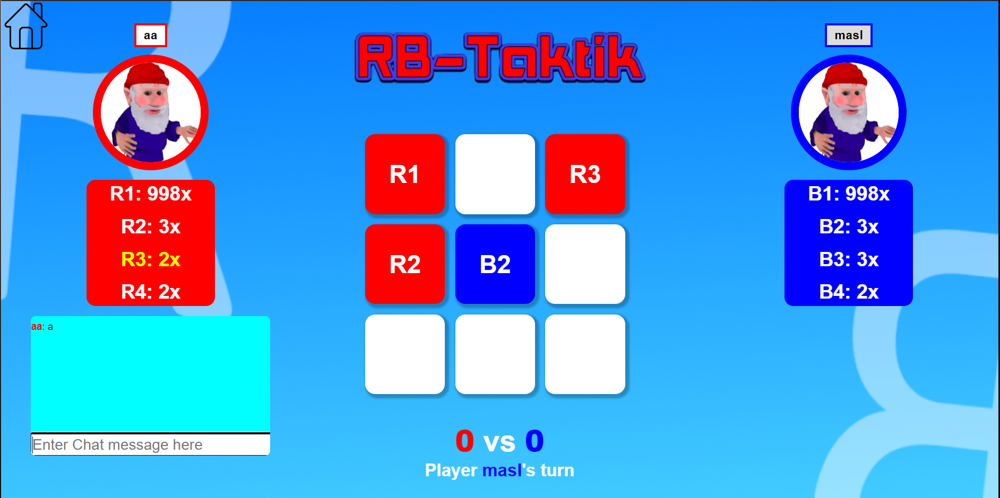
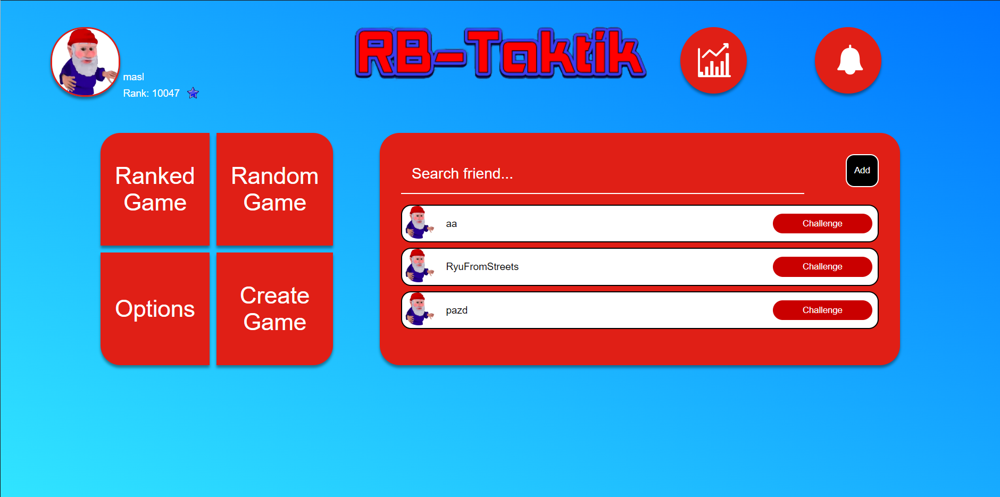
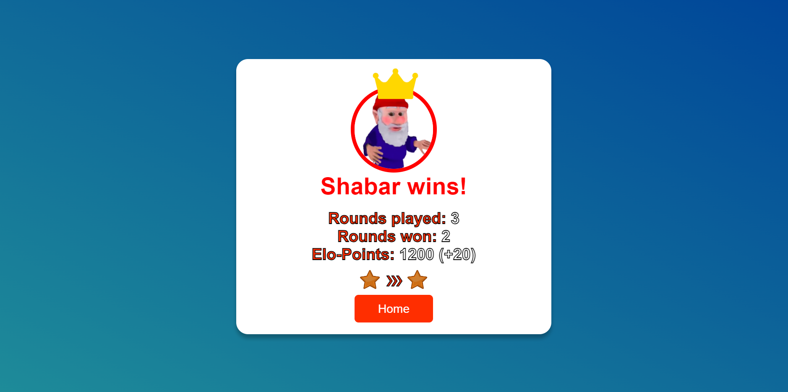

# RB-Taktik

A goofy web game me and a few others created as our school project.

## Project status
The project is functional and most things work fine. It is not finished but we as the group are done with it. 

It will therefore probably not receive any major updates from now on.

You can [try it out](#trying-it-out) though!

## What is RB-Taktik
Essentially its tic tac toe but you have several numbered pieces, which can overbid lower numbered pieces.
Of course the amount of high numbered pieces is limited and that is where the challenge comes in.

The person that has 3 in a row wins or alternatively if your opponent cannot do any move on their turn they lose automatically.

## Trying it out
RB-Taktik is currently hosted [here](https://rb-taktik.marceldobehere.com).

(Please don't try to break the server lol, ty)

## Technologies
The game uses HTML/CSS/JS with Socket.io client side and NodeJS with Express and Socket.io on the server.

The server can also be placed in a docker container.

## Features
* ✓ Game logic
* ✓ Account system
* ✓ Friend system
* ✓ Ranking system
* ✓ Notification system
* ✓ Music
* ✓ Guest play
* ✓ Match system
* ✗ Mobile version
* ✗ Account customization (like changing pfp)

## Development

### Setup
To run the project, node is required.

After you have installed node, these are the steps to get everything set up:
* Clone the repo
* Navigate into the `rb-taktik` directory
* Run `npm install`

For the mail system you should have a mailjet account and public/private key that you would put into the `rb-taktik/secret` directory as `auth.json`. An example of how the file would look like can be found in `rb-taktik/secret/auth-example.json`.

### How to run using http (local development)
* Navigate into the `rb-taktik` directory
* Start it using `npm run start`

### How to deploy as https (local)
* Navigate into the `rb-taktik` directory
* Start it using `node index.js -https`

If this is your first time, you will need to paste in a ssl certificate into the `rb-taktik/data/ssl` folder. This should be explained in the console when running it though.

### How to deploy as https (docker)
You may need to modify the `docker-compose.yml` and the `entry.sh` files to suit your needs.

* Navigate to the main directory 
* Run the `start.sh` script.

This should have created a docker container with the server running.

### Note
Hosting this on a custom domain will require the ssl certificates and you need to update the domain in the `rb-taktik/yesServer/passwordResetSystem.js` file. (You need to change `RB_TAKTIK_ADDRESS`)

## Credits
This game was created by four people:
* [Marceldobehere](https://github.com/marceldobehere) Backend/Frontend
* [PossiblyExo](https://github.com/PossiblyExo) Design/Frontend
* [Diekenz06](https://github.com/diekenz06) Music/Frontend/Design
* [AlNablsi](https://github.com/AlNablsi) Frontend/Gameplay-Design

## Screenshots

